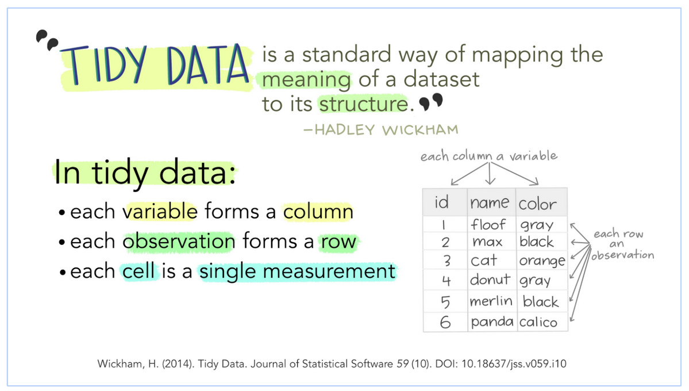

```{r klippy, echo=FALSE, include=TRUE}
klippy::klippy(position = c('top', 'right'))
```

First and foremost, it is good practice when dealing with text to run the following at the beginning of the R session. 

```{r}
options(stringsAsFactors = FALSE)
```

# Data types in R (very briefly)

R has officially six different data types, of which four of them we will be concerned with: character, numeric, integer, and logical. We can quickly tell what kind of data type we are working with by using typeof() or mode() functions (they're slightly different but from our standpoint they will be same.)

```{r}
typeof('hello') # character
typeof(52L) # the 'L' tells R to store it as an integer
typeof(2.542) #double, ie numeric
typeof(FALSE) #logical
# if we make an assignment typeof() will tell us the data type of the underlying value
x <- 2.52; typeof(x)
y <- "Hello"; typeof(y)
```

If we try to do operations on data types that don't make any sense, R will let us know.

```{r, error = TRUE}
x + y
```

Obviously, if we ask R to tell us what 2.52 + "Hello" is, it's going to be hard to give a reasonable answer. (Notice the somewhat cryptic error message, we're going to have to get used to that, though some of the packages we'll be using are really making an effort to be more helpful.) In this case it's obvious, but as you do more and more complicated things in R with larger and larger amounts of data it will not always be the case. This is a frequent source of bugs and something to be aware of from the beginning.

Data structures are ways and forms of combining data. The simplest way of doing this is with a "vector" essentially a list (but lists are different as we'll soon see). You've already seen how to create vectors:
```{r}
c("Hello", "how", "are", "you", "?")
```

Other data structures we will work with are matrices (essentially two dimensional vectors, corpora, term frequency matrices and so on, but especially dataframes. These structures have different rules and frequently they are picky about what sort of operations they allow you to do with them, even if they look similar. Vectors and matrices, for instance can only hold one type of data. 

```{r, error = TRUE}
(c <- c(5, "hello!")) # Notice what happens here - the 5 is "coerced" into becoming a character. 
c[1] + 1 # Thus you can't do arithmetic anymore on the 5 -- 5+1=6 but "5"+1 is the same kind of operation as 2 + "Hello".
```

But you can do this with the data structure lists, which otherwise look quite similar to vectors. 

```{r}
(l <- list(5, "hello!")) # this does not coerce the 5 to become a charcter
l[[1]] + 1 # and this now works because the 5 is still a number. Notice contents of lists are subset by double [[]]
```

You can put all kinds of things together in lists and name them
```{r}
ll <- list(name = "Bob", age = 50, ingarage = head(mtcars))
names(ll)
```

Two-dimensional vectors are matrices (must have all same data type) and 2D lists are dataframes. To find what data structure we are dealing with, we type class()
```{r}
class(ll)
str(ll)
```

The str() command is also quite helpful, showing data structure, data types, names, and dimensions (which can also be found via length()). The main point to be remembered is that trying to do things with the wrong type of structure of data is a very common sources of problems. Especially as we get into more advanced text analysis packages we'll always want to keep in mind what the structures and types of data we're dealing with are.


## Tidy data

```{r, echo=FALSE, fig.align="center", fig.cap = "Julie Lowndes & Allison Horst, https://docs.google.com/presentation/d/1N7hKepabvl9OrHjvGJWPjUsfzVdB5xzV5AsFndgSwms/edit#slide=id.p"}

```

Which of the following is tidy?
```{r, message=FALSE}
library(tidyverse)
table1
table2
table3
table4a
table4b
```

There are real strengths to organizing data this way for readibility, consistency, collaboration, among other reasons. In addition, the folks at tidyverse really go out of their way to make user-friendly packages, as we'll see again and again over the next two days. For that reason, we're going to be doing as much of our work as feasible in the tidyverse, stepping out when we need to, then coming back in to visualize. 

The tidyverse has it's version of dataframes, which are called tibbles. We'll be using these.

# Plotting and visualization

The workhorse plotting machine in the tidyverse and one of the most used individual packages in R is called ggplot. 

ggplot works on the assumption of tidy data -- one line per observation, one column for a variable. To create a minimum plot in ggplot we call the function, specify where the data is coming from, specify aesthetic mappings (what variable is mapped to the x- and y-axes).

```{r}
ggplot(data = table1, aes(x = year, y = cases)) + #we'll use the tabel1 data from above, "+" tells ggplot that the call continues to the 
                                                              # next line
  geom_point()                                  # how should data be represented, here with points
  
```

We can see that we have six observations (lines of our dataframe tabel1) and this graphs them all. But it's not clear what is what. First perhaps in addition to having points we'd like to see lines between the two points of the same country to be able to easily see rises or falls. And it would be nice if the graph told us which countries were being graphed and made it easier to distinguish. ggplot works by adding successive layers to a plot, which means we can start with code for a simple graph and add to it (see the [https://ggplot2.tidyverse.org/reference/index.html#section-layers](documentation) for other layers).

```{r}
ggplot(data = table1, aes(x = year, y = cases, color = country)) + # start with our first simple plot, add colors by country (also adds legend)
  geom_point() +
  geom_line() # adds lines between the points of points 
```

There are myriad other possibilities and changes you could make. Maybe we'd like to denote the different sizes of the underlying populations? We can add titles. And we can also shift from the standard ggplot grey background to black and white, which many people think looks cleaner. 

```{r}
ggplot(data = table1, aes(x = year, y = cases, color = country)) + # start with our first simple plot, add colors by country (also adds legend)
  geom_point(aes(size=population)) + # size based on population is a change to the way the data is visualized (maps it to an aesthetic) and thus goes                                      # in aes(). It might not always be obvious what goes in aes() and what doesn't.
  geom_line() + # adds lines between the points of points 
  labs(title = "Cases in three countries", xtitle = "Year", ytitle = "Cases") +
  theme_bw()
```  

There's lots more we could do but for our purposes (an absolute barebones, skimming-the-top-of-the-surface introduction to ggplot) this will suffice. Good texts on producing plots in ggplot (chapter 3 of @wickham2016r; @wickham2016elegant for a whole book; check the online [https://ggplot2.tidyverse.org/](documentation) for online course/webinar suggestions); and on graphics more generally in R (@healy2018data). 

ggplot can be pretty finicky and you'll write lots of ggplot code that doesn't work but you'll get better. Read the help files, look at documentation, and Google stuff (especially looking at postings on Stack Overflow) when you run into problems or want to know how to do things. 

# Dates

As historians, we will often be dealing with dates and there are real advantages to having R recognize our dates as dates rather than simply character strings or numbers. The data class we'll be most interested in is __date__ (date-time is the other major one, which gives both the date and time). If you just have a year there's generally not much to be gained above just treating it as an integer.

There are ways of converting numbers or strings into dates both in base R and within the tidyverse via package called ``lubridate``. I'll show both here, though as in everything else, the tidyverse tends to be more user-friendly and is always well thought-out.

```{r}
library(lubridate) #lubridate isn't part of the core tidyverse so you have to load it separately
(today <- "12-08-2021") # a character string (we could also get today's date, in date format, with the command: today(), now() for date-time)
(day <- as.Date(today, format="%d-%m-%Y")) # base R
(day <- dmy(today)) # lubridate
typeof(today); typeof(day)
class(today); class(day)
```

R stores dates as numbers (``double``) within a ``Date`` class. This means you can do arithmetic with it:
```{r}
day + 1 
```

Today + 1 day = tomorrow. Seems reasonable. 

But you can probably see how easy it is to get confused because dates might look exactly the same but have different structures.

```{r, error=TRUE}
day1 <- "1814-05-17"
day2 <- as.Date("17-05-1814", format="%d-%m-%Y")
day1; day2 # they look exactly the same, but:
day1 + 1 # doesn't work, day1 is a character string
day2 + 1 # does work, day2 is a date
```

The most likely thing we might need to do is change strings or characters to dates. There are numerous ways date strings might be saved and we can easily convert with lubridate using commands which indicate in which order days, months, and years come.

```{r}
ymd("2019-12-25") 
mdy("12/25/2019") # American standard
dmy("25.12.2019") # lubridate will also recognize various possible separators
dmy("21st of June in the year of our lord 2018") # as well as month names and possible phrasings, it's really pretty smart
dmy("den 2. februar 2019") # and multilingual, though this will depend on your language locale (Sys.getlocale (category = "LC_ALL"))
```

Then you can do the reverse, extract the day, month, or year from ``date`` or ``date-time`` objects.

```{r}
(today())
year(today())
month(today())
day(today())
week(today()) # useful for foreigners in Norway
wday(today(), label = TRUE, abbr = FALSE)
```

For a great, short introduction to dates see chapter 16 in @wickham2016r or online [https://lubridate.tidyverse.org/](documentation) for the package ``lubridate``.

# References