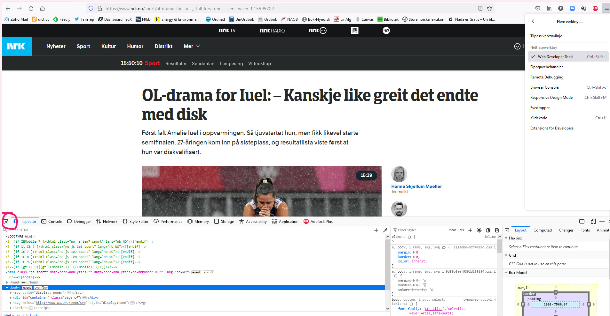
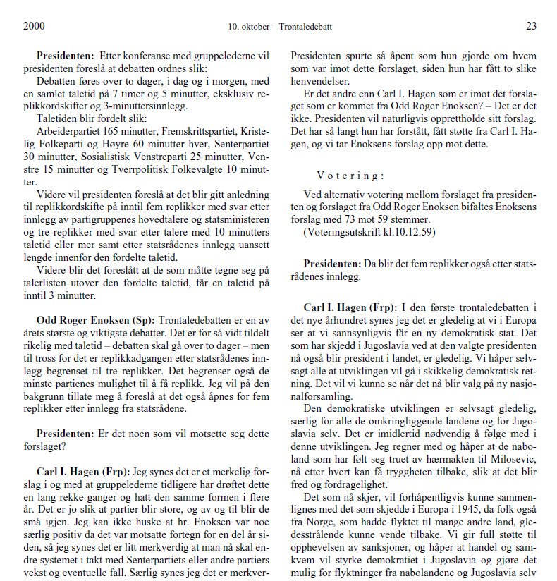
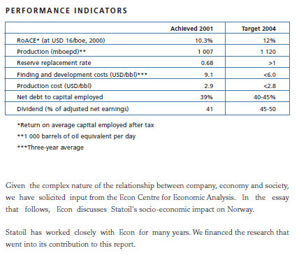
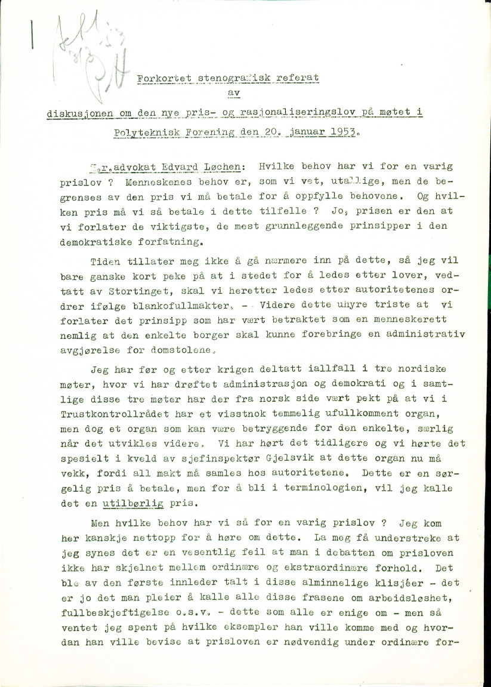

```{r klippy, echo=FALSE, include=TRUE}
klippy::klippy(position = c('top', 'right'))
```

# Web scraping

Web scraping is a huge and often quite complicated topic that one would rightfully want to dedicate an entire workshop, possibly much longer than 2 days, to. Given that this is a large and rich potential source of text for historians, we look at just the _very_ basics here.

Say we'd like to scrape stories from nrk.no. Let's just pick a random [one](https://www.nrk.no/sport/ol-drama-for-iuel-_-full-forvirring-i-semifinalen-1.15595722).

```{r, echo=FALSE, fig.align="center", fig.cap = "Top story on nrk.no when I was preparing this presentation"}
knitr::include_graphics("data/nrk.jpg")
```

We'll use a library called ``rvest``. We'll first call the library, enter the url and use ``read_html`` to download the data from that url.

```{r}
library(rvest)
url <- "https://www.nrk.no/sport/ol-drama-for-iuel-_-full-forvirring-i-semifinalen-1.15595722"
nrk <- read_html(url)
nrk
```

So we have it? Well, kind of. We have "it" but we also have a whole lot more. There's a lot of information on this page, much of which we don't need or want to collect. The menus, the other related stories, and so on. Plus, what we get with R is not just what we see but a whole ton of tags and definitions that are intended for our browsers, not for us. We maybe want the text, headline, author, and the date. So how do we get this information, no more no less?

We'll need to go into the actual HTML code and find the information and then tell R where to get it. Luckily this is a bit easier than it sounds. In your web browser go to the menu button -> More tools -> Web Developer Tools.

You'll get a panel of web developer tools. On the top menu line of the panel is an icon (circled in the image below) for selecting an element in the page.

```{r, echo=FALSE, fig.align="center", fig.cap = "This will look slightly different in different browsers."}

```

With this selected, you now want to find the parts of the page you want to extract. When you go to the journalists' names and hover over with your mouse, you will see a box above with ``a.author__name`` written in it. That's the html tag telling the browser how to display the author's names and that's what we'll tell R to extract.

```{r}
authors <- nrk %>%
  html_elements('a.author__name') %>%
  html_text()
authors
```

We do the same with the thing with the headline, date and text (it might take some experimentation to get this right).

```{r}

headline <- nrk %>%
  html_elements('h1.title.title-large.article-title') %>%
    html_text()

text <- nrk %>%
  html_elements('div.lp_articlebody.text-body.text-body-sans-serif.container-widget-content.nostack.cf') %>%
  html_text()
text
```

The date is a little bit trickier (as is the sub-headline). First of all, for me, looking at it the day of, the date is just "i dag". That's not too helpful for posterity. But it's not just that, it's within a ``span`` class that's not going to recognize for various and sundry reasons anyway (you can try it). But if we click on the date and then look in the developer tools panel below (or on the side if its Chrome) it will show us that this span class is itself embedded in a a time tag (one line up from the span with the date-time) which in turn has a date-time. When we hover over this line we now see a box over the date with 'time.datetime-absolute.datePublished' written. Let's see if this works. 

```{r, warnings=FALSE}
library(lubridate)
date <- nrk %>%
  html_element('time.datetime-absolute.datePublished') %>%
  html_text()
date
```

This has it, but more than we want. We have some "\n" which is code to create a new line on the page. There might well be a way to fine tune our html_element() parameters with ``rvest`` to get it to extract just the information we want but we can also do this with other R tools. We'll use [``stringr``](https://stringr.tidyverse.org/) (yet another member of the tidyverse). ``stringr`` is a package to search ad manipulate character strings. What we need is something that will extract just the date from the above character string ``time``. To do this we'll think back and remember the tutorial on regular expressions. We'll extract the portion of the string that matches the DDDD-DD-DD pattern, where D are digits.

```{r, warnings = FALSE}
library(stringr)

date <- date %>%
  str_extract(pattern = "[0-9]{2}.[0-9]{2}.[0-9]{4}") %>% # should be //.
  dmy()

```

So we've now extracted all the information we want. We can put it all together in a dataframe now.

```{r, message=FALSE}
library(tidyverse)
(article <- tibble(Author = authors, Date = date, Headline = headline, Text = text))
```

Note in true tidy form its creating two rows of this dataframe, two "observations", one for each journalist. We got this because we had two authors and they were in a vector of two items (each name). To condense we could concatenate them into one object.

```{r}
(authors <- str_c(authors, collapse = ", ")) # also from stringer, concatenates multiple character objects into one
(article <- tibble(Author = authors, Date = date, Headline = headline, Text = text))
```

## Links to more information

As noted, this is just the barest of introductions. I wanted, however, to at least go through the basics because it's a rich source of possible texts for historians. As of just a few years ago if you wanted to do sophisticated web scraping you really had to turn to Python. And Python perhaps still has the edge, particularly with a library called BeautifulSoup.^[A good, thorough introduction for those interested is @mitchell2018web.] But packages in R have come a long way in the last couple years and you can now do pretty sophisticated scraping in R as well. I attach a few links that will help you get started if you are so interested.

- https://rvest.tidyverse.org/articles/harvesting-the-web.html
- https://towardsdatascience.com/tidy-web-scraping-in-r-tutorial-and-resources-ac9f72b4fe47
- https://github.com/yusuzech/r-web-scraping-cheat-sheet/blob/master/README.md
- https://www.scrapingbee.com/blog/web-scraping-r/


# Reading in Documents

We'd be nowhere without documents! And getting them into R is no trivial task. The first question to ask is, what is the format of the documents I want to read into R? 

## CSV Files

A CSV file stands for comma separated file and we should all be so lucky as to have corpora already in this form. True to its name it is a file where categories (columns in a dataframe) are delimited by commas and observations (rows) are delimited by rows. They will probably open automatically on your computer in Excel. 

Here I give you the example of a CSV I created from scraped Stortinget proceedings. This is a very partial (10.000 statements) piece of the much larger corpus of all statements from the late 1980s to 2020 (if you're interested in the whole thing just let me know, I have the German Bundestag (1949-2020) and Russian Duma (mid-1990s-2020) also. Quality variable). The file is structured in the following manner: each statement is one line (tidy!), variables are the date, Storting session, speaker name, party, and text of the statement.

```{r}
stortinget <- read_csv('./data/stort.csv') #update with url
```

The ``read_csv()`` command is from the readr package a part of the tidyverse. And the message it shows us is helpful -- readr is essentially looking at the data and guessing its structure and type. This is helpful for us to know, as it will impact what sorts of operations we can do on these individual columns.

Let's check what we have.
```{r}
stortinget
```
And this gets at a frequent problem -- encoding of non-English language characters. Here we see that å, æ and ø are not reading correctly. this is something we'll need to be on guard for always.

In this case, tidy, while it does a great job with most things, has trouble with Norwegian (we're not the [first to notice](https://github.com/tidyverse/readr/issues/892). As noted at that link, we can either specify latin1 as our locale or use base R command read.csv(). Doing this, things look like they should (you can check that this is the case). As noted in the post, this will depend on settings on your local computer.

```{r}
stortinget <- read_csv('./data/stort.csv', locale=locale(encoding = "latin1"))
stortinget
```

## Reading in txt, doc or pdf files

Historians are interested in old books and there are a lot of old books freely accessible on the web already digitized (and some of them even cleaned). I just read _Ut og stjæle hester_ over summer vacation so I've downloaded four novels of Charles Dickens, starting, of course, with _David Copperfield_ in four different file formats.

```{r}
(books_list <- list.files(path = "data/docs", full.names = TRUE))
```

``readtext`` is a handy R package that will automatically decide what sort of file it is, read it in, AND will help us out with variables associated with the document. 

```{r}
library(readtext)
books <- readtext(books_list)
# Notice this will save as a readtext object. Let's convert to our tidyverse's format for dataframes, called a tibble.
books <- as_tibble(books)
```

Notice that it has read these texts into R and we now have them all in a dataframe. But, unlike the Stortinget csv, we have no metadata (document variables). ``readtext`` allows us to import variables automatically from file names (assuming we have informative file names, which, as it _just so happens_, we do). We can do similar things with the help of the tidyverse and a function called [``separate``](https://tidyr.tidyverse.org/reference/separate.html). 

```{r}
books <- readtext(books_list, docvarsfrom="filenames", dvsep = ' - ', docvarnames = c('Title', 'Author', 'Year')) %>%
  as_tibble()
books
```

(There is an R [package](https://cran.r-project.org/web/packages/gutenbergr/vignettes/intro.html) for accessing Project Gutenberg that you would actually want to use that would be easier than downloading things by hand. 


## PDFs that use columns or other different text layouts

``readtext`` and a similar R package called pdftools are great but they get flummoxed by weird text layouts, including kinds you find quite often in official state documents.

```{r, echo=FALSE, fig.align="center", fig.cap = "Sample page of Storting proceedings. Bundestag proceedings, and doubtlessly many more, are formatted the same way."}

```

readtext is going to have a hard time with that. You can try it yourself but it's going to read from left to right across columns, rather than the left column first then the right. 

As of a couple of years ago one had to get really creative and cut the pdfs up and then sew them back together but now we have an R package that is quite smart about this called ``tabulizer``. The package has java dependencies that might create huge problems in Windows -- on my windows machine despite hours trying to troubleshoot I still have not been able to install it. I have a Linux machine that it works fine one so I use this, another option is to use Rstudio's quite cool cloud service at https://rstudio.cloud. We can upload documents there, install the packages we need on then download the resulting dataframe we build there. 

Let's take a historical Storting melding. The front page looks like this.

```{r, echo=FALSE, fig.align="center", fig.cap = "Clear machine-readable text but in columns."}
knitr::include_graphics("data/st_meld.jpg")
```

Other documents are printed in multi-column format as well. First we might try ``readtext`` and print out the first 1000 characters to see how things look.
```{r}
df<- readtext('data/stmeld8_kongo.pdf')
str_sub(df$text, 1, 1000) # if we print out in cat() we see that the spacing is preserved from the original pdf
```

It looks like we've read in a bunch of text, and we have. But if we look a bit closer, we see that the first sentence of the document in the pdf reads: "Den 30. juni 1960 ble tidligere Belgisk Kongo proklamert som selvstendig stat." But ``readtext`` ignores the column space and has: "Den 30. juni 1960 ble tidligere Belgisk Kongo     Samtidig med dette brøt Katanga-provinsen\\nproklamert som selvstendig stat." And we see the whitespace that is actually the column break. There are actually methods we're going to use that will throw out word order and this sort of thing wouldn't matter. But not always by any means. 

The tabulizer package is just as easy. Tabulizer can be probelmatic to install because of Java dependencies but run either from your own PC or from the RStudio cloud, it gives a much better result for no extra work. 

```{r, eval = FALSE}
library(tabulizer)
file <- 'data/stmeld8_kongo.pdf'
numpages <- get_n_pages(file) 
text <- extract_text(file, encoding = 'UTF-8', pages=1:numpages) # this will return a vector of one character string per page. Take the pages option out of the call and we get one collapsed character string for the whole document. 
```

Finally, tabulizer is an incredibly powerful package. If you have tables you'd like to read from pdfs, as economic historians very well might, I highly recommend tabulizer's very cool ``extract_areas()`` function. Say we have a page like below and we'd like to extract just the table.

```{r, echo=FALSE, fig.align="center", fig.cap = "Page 44 of Statoil's 2001 Sustainability Report."}

```

We can do this interactively with tabulizer. We can call ``extract_areas()`` and then highlight the part of the page where the table is located telling tabulizer where to extract the table data from.

```{r, eval = FALSE}
extract_areas("data/SRs/SR-2001-equinor.pdf", 44)
```

If you have numerous documents with tables at the same place you can also specify location to have tabulizer do this over numerous documents. Powerful stuff.

## Reading in non-machine readable PDFs (hardest and probably most likely for historians)

Perhaps the documents we historians are most likely to want to analyze are hand-scanned archival documents. These we might have as pictures (jgp or gif or tiff formats perhaps) or pdf files on our local machine. To make these digitally analyzable we'll need to use optical character recognition (OCR) technology. This is a rapidly progressing frontier of machine learning and the technology is constantly getting better. Humans are still far better at reading and recognizing text than computers but the gap is steadily shrinking and might one day in the future disappear. For now though, we'll have to deal with less than perfection.

R has "bindings" (packages that give access to) tessaract, which is an open source Google OCR project. Tessaract reads png images so images not saved as png will need to be converted. Below is an example using pdftools to do this from .pdf (see the Tessaract [https://cran.r-project.org/web/packages/tesseract/vignettes/intro.html](vignette) for an example of how to do this for .jpg files using the R package magick.)

The way OCR works is that the algorithms are made to "learn" by ingesting a large amount of data for which the right answers are known (ie. images of text that have been, perfectly, digitized). The algothithms trained to recognize English are included in the package, anything else has to be downloadde by hand as shown below (to find you needed language's three letter code, see the [https://github.com/tesseract-ocr/tessdata](tessdata) github repository). 

Here is an example from my archive photos, a document form the Norwegian Riksarkivet in Oslo. 

```{r, echo=FALSE, out.width="50%"}

```

```{r, eval=FALSE}
library(tesseract)
norsk <- tesseract(language='nor') #before doing this you will need to have run: tesseract_download('nor')
png_archivedoc <- pdftools::pdf_convert("./data/Pris- og rasjonaliseringslov - Riksarkivet - 1953.pdf", dpi = 600)
text <- ocr(png_archivedoc, engine=norsk)
```

# Appendix (slightly more advanced)

Back when we were scraping stories from the NRK website, we scraped one stroy. But probably what we'd really like to do is build up a _corpus_ of texts, not just one article but numerous. You could just do the above by hand and have a tibble for every article and then combine multiple tibbles to get one large tibble that had your whole corpus. But there is a much better way and one that will introduce a basic concept of programming called a "for loop". 

Assume we want to scrape a bunch of NRK stories. We can put the urls in a vector in R.

```{r}
articles <- c("https://www.nrk.no/sport/grovdal-fullstendig-parkert-i-ol-finalen_-_-det-er-rett-og-slett-litt-vondt-a-se-pa-1.15595563", "https://www.nrk.no/sport/vant-heat-etter-fall-i-siste-runde_-_-umenneskelig-1.15595067", "https://www.nrk.no/vestland/hemmelig-plan-for-statsraad-lehmkuhl_-sommerskuta-dukket-plutselig-opp-i-bergen-1.15595488", "https://www.nrk.no/osloogviken/tiltalt-for-forsettlig-drap-pa-christian-halvorsen-1.15595796") # a random list of the top stories on NRK at the time of writing. Saving as character objects so remember to put the urls in quotes

```

I now have a list of urls and for each item of this list I want to do the same thing. So we will "loop" through this list doing what we just did for the one NRK article to each of the objects of this list. Here is the syntax. 

```{r}
corpus <- tibble()  # creating an empty tibble to copy everything into
for (url in articles){ # looping over our list of 4 urls
  nrk <- read_html(url) 
  authors <- nrk %>%
    html_elements('a.author__name') %>%
    html_text()
  authors <- str_c(authors[[1]], collapse = ", ") # also from stringer, concatenates multiple character objects into one
  headline <- nrk %>%
    html_elements('h1.title.title-large.article-title') %>%
    html_text()
  text <- nrk %>%
    html_elements('div.lp_articlebody.text-body.text-body-sans-serif.container-widget-content.nostack.cf') %>%
    html_text()
  date <- nrk %>%
    html_element('time.datetime-absolute.datePublished') %>%
    html_text() %>%
    str_extract(pattern = "[0-9]{2}.[0-9]{2}.[0-9]{2}") %>%
    dmy()
  article <- tibble(Author = authors, Date = date, Headline = headline, Text = text, URL = url)
  corpus <- rbind(corpus, article) # rbind stands for "row bind". We copy the rows of our new article dataframe to the old corpus dataframe which at the end of the for loop will give us a dataframe called corpus with all the data from our four articles
  }
```

In words, we are telling R: "Hey R, I have a vector (i.e. a list) called ``articles``. I want you to go into this vector and look at each object individually. We're going to call these objects ``url`` (note we could call them anything at all, this is just name. Often objects in for lists are called i, sometimes x, etc.) For each individual object in my vector, do what is written in the curly braces (all the steps we went through to scrape one article").  

# References
