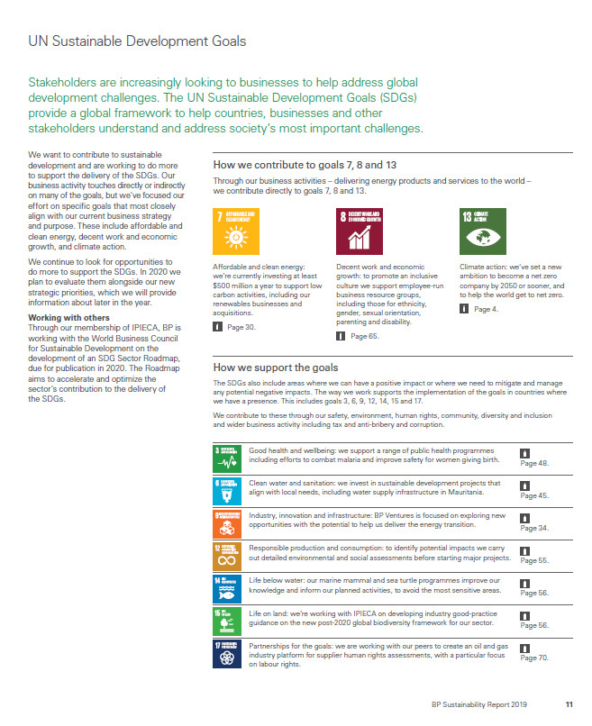

```{r klippy, echo=FALSE, include=TRUE}
klippy::klippy(position = c('top', 'right'))
```

# Types of cleaning

As we've seen already, almost always when documents in the real world are read into R they are highly imperfect. They will have all kinds of crazy tags, whitespaces (which also show up as tags under some viewing methods), and other things we may want to strip. In fact, in the real world collecting and cleaning data generally takes at least as long as analysis. A fairly balanced workshop on text analysis would probably rightly spend at least half of its time on these issues and less on analytics. We'll get on to analytics in the next section but it's important to realize that these initial ones are just as important, even if they seem a little dull and uninspiring.

We'll use two sample corpora as examples and test corpora for the rest of the workshop. The first is Nobel Peace Prize award ceremony speeches since 1905. They are scraped from https://www.nobelprize.org using the slightly more advanced methods than we'll discuss here. For code and brief discussion, see the [Appendix](#Appendix). The second is a corpus of Sustainability Reports for several major international oil companies. 

```{r, message = FALSE}
library(tidyverse)
nobel <- read_csv("data/NobelPeace.csv", locale=locale(encoding = "latin1")) %>%
  select(!X1)
sr <- read_csv("data/srps.csv")
```

# Viewing your tibble corpus

So after the first two sessions we're assuming we have our corpus in a tibble, with one column being the text of the documents and other columns of metadata -- year and company for the Social Responsibility reports, laureate and year for our Nobel Peace Prize award speeches. First things first, there are numerous ways to try to get an overview of the data. If you just enter the dataframe's name in R you will get the first few lines. Alternately, you can use ``print()`` -- tibbles are [build](https://tibble.tidyverse.org/reference/formatting.html) to make printing and viewing dataframes easier. If we want to print all rows (you have to be careful with this, if you have millions of rows this will probably crash R) we can do this.

```{r}
nobel # note that this tells you the datatype of each column
print(nobel, n = Inf)
```

Other options are ``glimpse()`` (tidyverse) and ``str()`` (baseR) that give you different ways to visualize a bit. Often the easiest is to ask R to open a separate window with ``View()``. Finally, sometimes if you have a long character string the easiest way to inspect it is simply to print it out separately. Using the ``cat()`` command will format using the formatting tags in the text -- it will look nicer but you might want to know where the /n and /t tags (newline and tab markers) are.

```{r}
#View(nobel) # opens a new window
nobel$AwardSpeech[4] # will show the fourth line of the text column of the nobel dataframe
cat(nobel$AwardSpeech[4]) # nicer formatting but now you're not seeing formatting tags in the text
```

## White spaces, urls, tags, etc.

As noted, we might well want to strip artefacts of the scanning and importing process so we only have the text itself. Looking at our ``nobel$AwardSpeech[1]`` call above we see some \t's, \n's, \r's. These are [escape characters](https://en.wikipedia.org/wiki/Escape_character). To see what they do:

```{r}
test <- "     Here \n there and \t\t\t everywhere.\n"
print(test)
cat(test)
```

There are also things like ``\u0092`` that are charcter encodings that have gotten garbled -- this one representing an apostrophe. We also might want to look for where there is more than one space and replace it with one, remove white space at the beginning... and so on. We can use stringr's ``str_replace_all`` to do all this and utilize our knowledge of regular expressions (the stringr [documentation](https://stringr.tidyverse.org/) and cheatsheet are especially helpful).

```{r}
# Practice on our small test string
test <- "     Here \n there and \t\t\t everywhere.\n"
test_clean <- str_replace_all(test, "[(\\n)(\\r)(\\t)]", ' ')
test_clean <- str_replace_all(test_clean, " {2,}", " ")
test_clean <- str_replace_all(test_clean, "^ *| *$", "")
test_clean
```

That removed all those spacing encodings and whitespace. But it won't be any surprise to you anymore that the tidyverse actually makes this much easier for us.

```{r}
str_squish(test) 
```

So that was simple. Now the unicode encodings from the Nobel speaches.

```{r}
speech <- nobel$AwardSpeech[1]
str_replace(speech, "\u0092", "'")
```

<!-- Well, that should have worked, but didn't. In fact, when we search for that escaped unicode character, regex is actually searching for the character itself, not the code. So we have to double escape it. Which is R means 3 backslashes. One final change that is usually made is to make all letters lowercase so as to make word searches easier. -->

```{r}
speech %>%
  str_replace_all("\u0092", "'") %>%
  str_replace_all("(\u0093)|(\u0094)", '"') %>%
  str_squish() %>%
  str_to_lower() %>% # make all letters lower case
  writeLines()
```

That looks pretty clean just as text. For most of our text analysis we're actually going to remove all punctuation, but there is an argument to be made for getting as clean an original text as you can to start out with. Now that we know how to use ``stringr`` and regular expressions, we can easily strip out all punctuation. (some of the packages we will be using will also do this automatically for us as well)

Let's do that to the whole nobel corpus. We can either write a loop (seen as less good) or use the tidyverse (better).

```{r}
# for (i in 1:dim(nobel)[1]){
#   nobel['AwardSpeech'][i,] <- nobel['AwardSpeech'][i,] %>%
#     str_replace_all("\u0092", "'") %>%
#     str_replace_all("(\u0093)|(\u0094)", '"') %>%
#     str_squish()
#}

#OR

(nobel <- nobel %>%
  mutate(clean_text = str_replace_all(AwardSpeech, "\u0092", "'")) %>%
  mutate(clean_text = str_replace_all(clean_text, "(\u0093)|(\u0094)", '"')) %>%
  mutate(clean_text = str_to_lower(clean_text)) %>%
  mutate(clean_text = str_squish(clean_text)))
```

We can compare AwardSpeech with text columns, ``nobel$clean_text`` does indeed look cleaner.

```{r}
nobel <- nobel %>%
  select(Year, Laureate, clean_text) %>%
  rename(Year = Year, Laureate = Laureate, AwardSpeech = clean_text)  # renaming cols
write_rds(nobel, "data/nobel_cleaned.Rds")
```

More information on regular expressions:
- https://www.princeton.edu/~mlovett/reference/Regular-Expressions.pdf
- @wickham2016r, chapter 14.
- 

## Excercises

- Look at other excess text in the Nobel corpus. How can we write code to cut these peices out?
- Are the problems the same with the SR report corpus? Take a look and see if we can run the same code or we need to do different things to clean that corpus.


# Manipulating dataframes

At this point there is actually a fair amount we can do with our corpus as a dataframe and text corpus in one column. To help us manipulate dataframes, let's take a quick look at the tidyverse's system of manipulation by common-sense verbs.

With ``nobel`` we have a dataframe of speeches from 1905 to 2019 (with some holes where there was no prize given out). How do we subset this dataframe so we have only speeches from 1950-1980? Use filter.

```{r}
nobel %>%
  filter(Year >= 1950 & Year <= 1980)
```

Here we've said to filter the corpus based on rows where Year is greater or equal to 1950 and less than or equal to 1980. & is the "and" operator, | is "or", and ! is not. 

```{r, eval = FALSE}
nobel %>%
  filter(Year == 1950 | Year == 1980) # returns rows for 1950 and 1980
nobel %>%
  filter(Year >= 1950 & Year <= 1954 & Year != 1953) # returns rows >= 1950, <=1954 and not 1953
```

``mutate`` adds new columns. Say we'd like a column telling us whether the year was before WWII or after.

```{r}
nobel %>%
  mutate(after_WWII = Year > 1945)
```

One thing I often do is use ``mutate`` to do word counts of every document row, essentially by counting all clusters of words or numbers that are separated by spaces on either side.

```{r}
nobel <- nobel %>%
  mutate(wc = str_count(AwardSpeech, '[\\w]+'))
```

And now we can finally start doing some analysis! Right now you will note that if we want to plot the length of award speeches over time, we have a Year column that could be an x-axis variable and a word count column as y-axis. This sounds tidy to me.

```{r}
nobel %>%
  ggplot(aes(x = Year, y = wc)) +
  geom_line() # just line graph, we might add geom_point() to underscore that we have missing years
```

Tidy offers us the handy ``summarize`` command to summarize. First, can we sum all the word counts to get a total word count for our entire Nobel corpus? And average word count?

```{r}
nobel %>%
  summarize(average = sum(wc))
nobel %>%
  summarize(average = mean(wc))
```

Where summarize really shines though is if we have groups. Let's split our corpus up by decade and then we'll get average word counts by decade using the ``group_by`` function.

```{r}
nobel %>%
  mutate(decade = (Year %/% 10) * 10) %>% # uses something called modulo division to get the decade
  group_by(decade) %>%
  summarize(mean(wc))
```

``summarize`` also has a ``n()`` function that can be helpful telling us how many observations per group we have. There were alot of years without a Nobel Peace Prize so this might be interesting to look at.

```{r}
nobel %>%
  mutate(decade = (Year %/% 10) * 10) %>% 
  group_by(decade) %>%
  summarize(n())
```

This also gives us all the tools we need to do google-style n-gram plots (there are many ways to do this of course). We count the number of words in the texts, group by year, and then plot.

```{r}
nobel %>%
  mutate(peace = str_count(AwardSpeech, "[Pp]eace")) %>%
  mutate(war = str_count(AwardSpeech, "[Ww]ar")) %>%
  mutate(humright = str_count(AwardSpeech, "[Hh]uman [Rr]ights")) %>%
  group_by(Year) %>%
  summarize(peace = sum(peace), war = sum(war), human_rights = sum(humright)) %>%
  pivot_longer(c("peace", "war", "human_rights"), names_to = "word", values_to = "counts") %>%
  ggplot(aes(x = Year, y = counts, color = word)) +
    geom_line()
```


## Excercises
- Make other n-grams of your choice of the Nobel corpus. Anything surprising?
- Using the SR corpus, find total word count of the corpus, graph word counts by company over time, and plot out n-grams of words of your choice.
- Chart n-grams over time per company with the SR corpus.


# Appendix

If we google "nobel prize ceremony speech", we land on a page that looks like [this](https://www.nobelprize.org/prizes/peace/2018/ceremony-speech/). We note that we can navigate to ceremony speeches of other years but this takes a lot of clicking. It's going to take a lot of work to program a bot to do this. BUT! If we look at the url we see that it's standardized with a year. What if we try the same thing with 2017? It gives us exactly the page we want. In fact, it does so for any year since the very earliest years of the prize. (Incidentally, navigating by links on the cite I have trouble accessing them before the 1960s.) This makes it very easy to generate a list of links.

```{r}
# https://www.nobelprize.org/prizes/peace/1905/ceremony-speech/   This is the link that we need to replicate changing the year for each year between 1905 and 2019. We'll start in 1905 as before that it's not really the speech but something less, we want to compare apples to apples as much as possible
library(rvest)
## https://www.nobelprize.org/prizes/peace/1905/ceremony-speech/
urls <- vector()
for (i in 1905:2019){
  new_url <- paste0("https://www.nobelprize.org/prizes/peace/", i, "/ceremony-speech/")
  urls <- append(urls, new_url)
  }
```

But not all these links exist because the Nobel wasn't given out in all years. If we try to open those years (try, for instance, https://www.nobelprize.org/prizes/peace/1915/ceremony-speech/) There are several ways we could deal with this, we could write down years it wasn't given out and remove them from our list of possible urls. But the other thing we can do is use a "try block" within our loop that tells R precisely that: try this, but if it doesn't work, just got on to the next object in the loop. We're going to do this, and then scrape the page in a similar way to which we scraped nrk.no in the last unit. We're going to be a bit more particular about what we edit out because we want only the the text of the speeches as much as possible, not the additional information (citation info, informational footers, etc) that the site gives us.

```{r, eval = FALSE}
corp <- tibble()
for (url_address in urls){
  try(
  {
    nobel <- read_html(url_address)
    text <- nobel %>%
      html_elements('article.page-content.border-top.entry-content') %>%
      html_elements('p') %>%
      html_text() %>%
      tibble()
    footer <- nobel %>%
      html_elements("footer") %>%
      html_elements('p') %>%
      html_text() %>%
      tibble()
    small_text <- nobel %>%
      html_elements("p.smalltext") %>%
      html_text() %>%
      tibble() %>%
      drop_na()
    copy_text <- nobel %>%
      html_elements("p.copy") %>%
      html_text() %>%
      tibble() %>%
      drop_na()
    remove_text <- rbind(footer, small_text, copy_text)
    remove <- vector()
    for (i in 1:dim(remove_text)[1]){
      for (j in 1:dim(text)[1]){
        if (text[j,] == remove_text[i,]){
        remove <- c(remove, j)
      }
    }
    }
    text <- text[-remove, ]
    total_text <- ''
      for (i in 1:dim(text)[1]) {
        total_text <- paste(total_text, str_c(text[i,1]))
        }
    laureate <- nobel %>%
      html_elements('li.list-laureate') %>%
      html_text() %>%
      str_trim() # trims white space before and after
    laureate <- str_c(laureate, collapse = ", ") # also from stringer, concatenates multiple character objects into one
    year <- str_extract(url_address, "[0-9]{4}")
    temp_tibble <- tibble(Year = year, Laureate = laureate, AwardSpeech = total_text)
    temp_tibble
    corp <- rbind(corp, temp_tibble)
}
  )
}

write.csv(corp, "NobelPeace.csv")
```

The second corpus is made up of 45 Sustainability Reports of major international oil companies for as long as available publically on the internet (these were hand-scraped -- sometimes simplest really is the best). This is an example of what the pdfs look like:

```{r, echo=FALSE, fig.align="center", fig.cap = "Sample page from BP's 2019 sustainability report."}

```

Lot's of tables, columns sometimes but sometimes not -- this is definitely a job for ``tabulizer``. With all the pdfs in one folder called "SRs" in the project root directory and with file names all standardized in the format SR-[year]-[companyname].pdf, we can extract metadata, read in the text and save it all as a tibble in just a few lines of code. Tabulizer really makes our lives a whole lot easier here. 

```{r, eval=FALSE}
library(stringr)
library(tabulizer)

files <- list.files("./SRs")
files <- files[str_detect(files, "SR-.*")]
srps <- tibble()
for (pdf in files) {
  pdf <- paste0("./SRs/", pdf)
  numpages <- get_n_pages(pdf)
  text <- extract_text(pdf, encoding = 'UTF-8', pages=1:numpages)
  df_new <- tibble(Text = text)
  df_new['Year'] <- str_match(pdf, '[0-9]{4}')
  df_new['Company'] <- str_match(pdf, "(?<=-)[a-z]*(?=\\.pdf)")
  srps <- rbind(srps, df_new)  
}

# Checking to see that we have everything, indeed we see 45 publications and the number of pages for each, which looks right
srps %>%
  group_by(Company, Year) %>%
  summarize(n()) %>%
  print(n = Inf)
```

# References