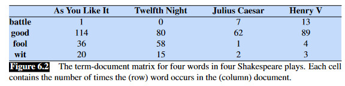
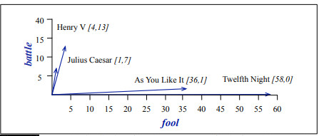

# Document-term matrices and other packages

We have up to now focused on text analysis within the tidyverse. The tidyverse is exceptional in its ease of use and user-friendliness. But at some point there will come time when we'll need to step outside tidy-organizing principles. 

To wit, there are (at the very least) two other data structures you will need to be familiar with to do text analysis. By far the most common is the document-term matrix or DTM. A DTM is a matrix where each column is a word and each row represents a document. Every cell then indicates the frequency of occurrence (this might be raw counts, logged counts, boolean (present/not present), tf-idf or some other statistic of frequency) of a given word in a given document. The sum of rows in this matrix will be the total word counts of individual documents and the sum of columns will be the total word counts for given words across the entire corpus. The sum of sum of rows or columns will be the total word count of the corpus in its entirety. These matrices are also sometimes organized with the rows and columns reverse in term-document matrices, as below.

```{r, echo=FALSE, fig.align="center", fig.cap = "@jurafsky2014speech, ch. 6, pg. 7 online at http://www.web.stanford.edu/~jurafsky/slp3/6.pdf."}

```

If all you care about are words in documents without concern for their order, this is a handy structure for the data (it is also super efficient as matrix operations on computers have been optimized to be incredibly fast). Indeed, methods that are built from DTMs are often called bag-of-words models or methods, because all word order is lost right at the very beginning.

You can't see it from the above example but in a real life corpus and dtm there will be as many rows as unique words in the corpus and there are tons of words that will show up only in the rare document. So much of the DTM will be zeros, making them so-called "sparse matrices". 

We can convert our tidy tibbles to DTMs with the ``cast_dtm`` function.

```{r, message=FALSE}
library(tidyverse)
library(tidytext)
nobel_tidy <- read_rds("data/nobel_stemmed.Rds") %>%
  select(Year, Laureate, word_stem) %>%
  rename(Year = Year, Laureate = Laureate, words = word_stem)
nobel_dtm <- nobel_tidy %>%
  group_by(Year) %>%
  count(words, sort = TRUE) %>%
  cast_dtm(Year, words, n)
nobel_dtm
```

Notice that what it prints out is not the matrix itself, or even the beginning of the matrix, but some summary information. We can call ``str`` on it to get a tiny idea of the structure but in general this is a more abstract class of data structure.

To get back our tibble structure we use ``tidy()``.

```{r}
tidy(nobel_dtm)
```

The same back and forth words for the dfm format, which is a document-term matrix structure used by the popular quanteda package. Quanteda offers a wealth of text analysis tools, models, statistics, and other functions. See their tutorial [here](https://tutorials.quanteda.io/).

The one exception to this is when we'd like to have document variables associated with the documents in our dataframes. Corpus and dfm structures from quanteda allow for document variables (an example of document variables for our Nobel corpus would be the laureate's name. But we could associate any years variables with these documents and then use them in analysis -- we'll talk a little bit about this when we talk about structural topic models.)

If we want to retain document variables into dfms then we'll need to "untidy" our data and convert into dfms via quanteda functions ``corpus()`` and ``dfm``. 

```{r}
(nobel_df <- nobel_tidy %>%
   mutate(decade = Year %/% 10 * 10) %>%
  group_by(Year, Laureate, decade) %>% 
  summarize(AwardSpeech = str_c(words, collapse = " ")) %>%
  ungroup())
```

These three lines effectively unnest and untidy our data, giving us back the dataframe we started with. Now we can convert it to a dfm (which we have to do via a corpus structure -- which is similar to our original data frame where there the document text is a character string and each document is associated with other variables).

```{r, message=FALSE}
library(quanteda)
nobel_corp <- corpus(nobel_df, docid_field = "Year", text_field = "AwardSpeech") # corpus() automatically includes all other columns that are not text and document names as variables
docid <- paste(nobel_df$Year, 
               nobel_df$Laureate, sep = " - ")      # naming our documents in the corpus in "Year - Laureate" format
docnames(nobel_corp) <- docid
nobel_tokens <- tokens(nobel_corp)
dfm_nobel <- dfm(nobel_tokens)
```

And now we're all set to work in quanteda!

# Similarity analysis

How might we, at the level of documents not just individual words, measure how close two documents are to one another? It might sometimes make sense for us to think of documents as collections or vectors. We've seen in previous tutorials a vector in R is just a list of objects but where all objects have to be of the same data type, the formal R data structure ``list`` allowing different data types. Here we're talking about vectors in a similar meaning but in a slightly more mathematical sense where vectors a geometric object with length and direction . We want to think about representing documents as vectors.

So what can this possibly mean? The idea actually comes directly from our document-term matrix where every row is a series of numbers (ie. a vector) with each entry denoting frequency of occurrence of the word denoted by the column. This list of numbers can then be given geometric interpretation. If we pretend we have a corpus made up entirely of two words, for every document-row we could count how many times word1 appeared, that would be the entry in the first column, and how many times word2 appeared (column two and then take the two entries and plot them on a graph - Cartesian coordinate plane or whatever you want to call it. Below gives an example of a two-dimensional document vector. 

```{r, echo=FALSE, fig.align="center", fig.cap = "@jurafsky2014speech, ch. 6, pg. 7 online at http://www.web.stanford.edu/~jurafsky/slp3/6.pdf. This is an extremely helpful resource that hits a nice 'technical but not too technical' note for many topics in natural language processing."}

```

The intuition here is that it says something about the document and _especially_ the documents in relation to one another if we think of them as vectors. Documents who have vocabularies more similar to one another will be, we can say, more similar in general, and will have vectors that are more similar. Thus if we can turn documents into vectors and measure the distance of document vectors from one another we might capture (in one sense) how similar they are to one another. Real-life documents of course map not onto two-dimensional vector space as above but n-dimensional where n is the number of unique words in a corpus. There's no way to visualize that but the intuition is the same, we can think of mapping each document into a vector space and then measuring its similarity to other document-vectors.

The tools to do this are actually pretty standard and straightforward. This is what you do in the first or second week of multivariable calculus or linear algebra. We'll save you the details but if you have done this stuff before your memory might be jogged by keywords such as "dot product" (measuring how far one vector extends in the direction of another) or law of cosines. If neither of those things means anything to you that's totally fine. The point is that we transform our documents into vectors, but their vectors at the same origin point and measure the angle in between them and call it the cosine distance. If two vectors have the same number of the same words or some multiple thereof (think about what would happen if one vector was a given document and another was two copies of that same document -- the second vector would point in the exact same direction simply twice as long. When the angle between documents is zero and the vectors are pointing exactly the same direction, we say the cosine distance is 1 (related to the fact that $cos(0) = 1$) and when the angle is 90 degrees (which means that they have no words in common and are as distant as they could possibly get) we say the cosine distance is 0 ($90^{\circ} = \frac{\pi}{2}$ and $cos(\frac{\pi}{2}) = 0$).

We care about document vectors in relation to one another, they're not going to tell us a whole lot on their own. Quanteda will make a nice little matrix of comparisons but if we have a 92x92 matrix it's going to be a little unwieldy. So let's break our corpus up into decades and compare decade by decade. Per our workflow, we'll do the transformation in the tidyverse, then transform our data to something quanteda can work with -- a dfm -- and then do the analysis with quanteda.

```{r}
library(quanteda.textstats)
dfm_nobel_grouped <- dfm_group(dfm_nobel, groups = decade)
cos_sim <- textstat_simil(dfm_nobel_grouped, margin = 'documents', method = 'cosine')
cos_sim <- as.matrix(cos_sim)
cos_sim_df <- as.data.frame(cos_sim)
cos_sim_df[lower.tri(cos_sim_df, diag = FALSE)] <- NA
```

And with a little wrangling we can turn it into a heat map via ggplot.

```{r}
cos_sim_df['Year'] <- colnames(cos_sim_df)
tot_gath <- gather(cos_sim_df, 1:as.integer(ncol(cos_sim_df)-1), key = 'to', value = 'cosine')
tot_gath <- tot_gath %>%
  mutate(cosine = round(cosine,2))
tot_gath %>%
  ggplot(aes(Year, to)) +
  geom_tile(aes(fill = cosine)) +
  scale_fill_continuous("",limits=c(.3, 1), breaks=seq(.3,1,by=0.2), low = "white", high = "blue", na.value = "white") +
  theme_bw() +
  geom_text(aes(label = format(cosine, nsmall=1)), color = 'white') +
  theme(axis.text.x=element_text(angle=0), axis.ticks=element_blank(), axis.line=element_blank(), panel.border=element_blank(),
        panel.grid.major=element_line(color='#eeeeee')) +
  labs(x = '', y = '', subtitle = 'Cosine Distances', title = 'Similarity of Nobel Peace Prize Award Speeches by Decade')
```

## Execises
- Calculate cosine differences in the sustainability report corpus by year and/or by company. How might we visualize this by year and by company at the same time?

## Co-occurance networks

Quanteda has a ton of different features -- tests, transformations, and visualizations it will do. One is co-occurrence matrices and network visualizations. The package has a data structure called the frequency co-occurrence matrix -- fcm -- where rows and columns are the words of the corpus and the cells of the matrix denote how many times those two word co-occur (in a document, within a certain word window -- the user determines this).

One can then plot a network of these words where the points (nodes) are the words and links between them (edges) are co-occurrences, edge thickness indicates frequency of co-occurrence. 

```{r, eval = FALSE}
nobel_tidy <- read_rds("nobel_stemmed.Rds") %>%
  select(Year, Laureate, word_stem) %>%
  rename(Year = Year, Laureate = Laureate, words = word_stem)
nobel_tidy <- nobel_tidy %>%
  mutate(decade = Year %/% 10 * 10)
nobel_df <- nobel_tidy %>%
  group_by(Year, Laureate, decade) %>% 
  summarize(AwardSpeech = str_c(words, collapse = " ")) %>%
  ungroup()
nobel_corp <- corpus(nobel_df, docid_field = "Year", text_field = "AwardSpeech") # corpus() automatically includes all other columns that are not text and document names as variables
docid <- paste(nobel_df$Year, 
               nobel_df$Laureate, sep = " - ")      # naming our documents in the corpus in "Year - Laureate" format
docnames(nobel_corp) <- docid
nobel_tokens <- tokens(nobel_corp)
library(quanteda.textplots)
fcm_freq <- fcm(nobel_tokens, context = "window", tri = FALSE)
#fcm_freq <- fcm(dfm_nobel_grouped)
top <- names(topfeatures(fcm_freq, 30))
size <- log(colSums(dfm_select(fcm_freq, top)))
fcm_top <- fcm_select(fcm_freq, pattern = top)
textplot_network(fcm_top, min_freq = .5)
```

And we can also change the size of labels according to frequency within the co-occurrence matrix.

```{r, eval = FALSE}
textplot_network(fcm_top, min_freq = .5, vertex_labelsize = 1.5 * rowSums(fcm_top)/min(rowSums(fcm_top)))
```

## Excercises

- Take a look at the quanteda package and calculate (and interpret) one or more of the following: (M)TTR, document complexity, keyness between two documents.


# References


